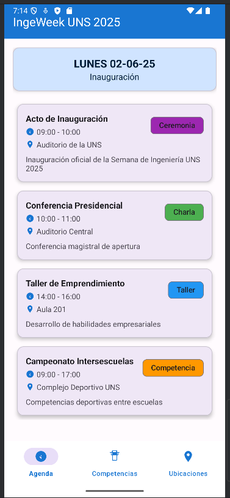
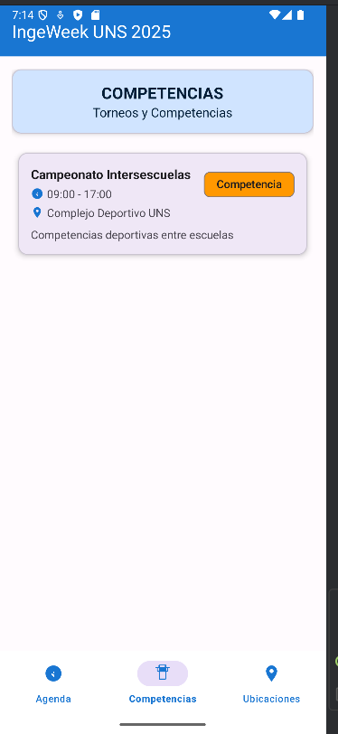
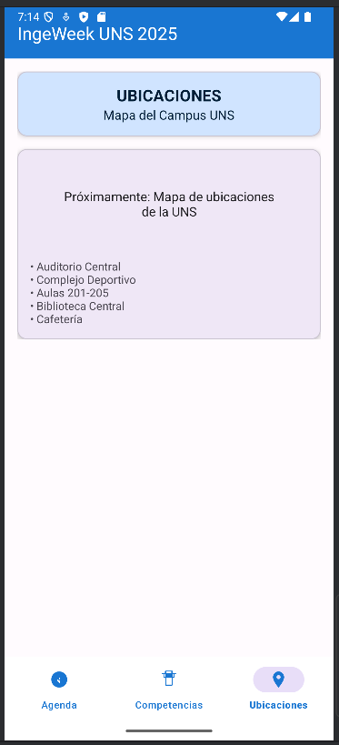

# 🏆 IngeWeek - Gestión de Competencias Universitarias

Una aplicación móvil para la gestión y seguimiento de competencias, torneos y eventos de la universidad durante la Semana de Ingeniería.

## 📱 Características

### Pantallas Principales
- **📅 Agenda**: Cronograma de eventos y competencias programadas
- **🏅 Competencias**: Lista de competencias disponibles y resultados
- **📍 Ubicaciones**: Mapa y direcciones de los lugares de eventos
- **🎯 Eventos**: Información detallada de todos los eventos

### Funcionalidades
- ✅ Navegación por pestañas (Bottom Navigation)
- ✅ Gestión de eventos y competencias
- ✅ Visualización de ubicaciones de eventos
- ✅ Agenda personalizada de actividades
- ✅ Información detallada de cada competencia
- ✅ Interfaz moderna y responsive

## 📂 Estructura del Proyecto

```
app/
├── manifests/
│   └── AndroidManifest.xml
├── kotlin+java/
│   └── com.example.ingeweek/
│       ├── adapters/
│       │   └── EventosAdapter.kt
│       ├── fragments/
│       │   ├── AgendaFragment.kt
│       │   ├── CompetenciasFragment.kt
│       │   └── UbicacionesFragment.kt
│       ├── models/
│       │   └── Evento.kt
│       ├── repository/
│       │   └── EventosRepository.kt
│       └── MainActivity.kt
├── res/
│   ├── drawable/
│   ├── layout/
│   │   ├── activity_main.xml
│   │   ├── fragment_agenda.xml
│   │   ├── fragment_competencias.xml
│   │   ├── fragment_ubicaciones.xml
│   │   └── item_evento.xml
│   ├── menu/
│   │   └── bottom_navigation_menu.xml
│   ├── mipmap/
│   └── values/
└── screenshots/
    ├── agenda.png
    ├── competencias.png
    └── ubicaciones.png
```

## 📸 Screenshots

### Agenda de Eventos

- Cronograma completo de la Semana de Ingeniería
- Filtros por día y tipo de evento
- Vista detallada de cada actividad

### Competencias

- Lista de todas las competencias disponibles
- Información de participantes y resultados
- Categorías y clasificaciones

### Ubicaciones

- Mapa interactivo de la universidad
- Direcciones detalladas de cada sede
- Rutas y accesos a los eventos
